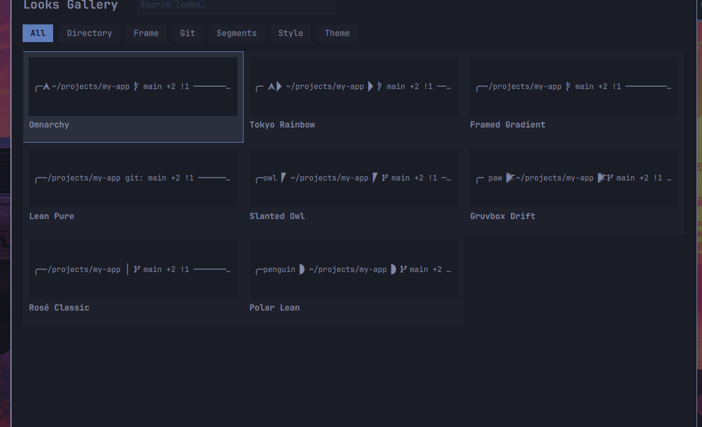

# Omarchy10k

A reactive shell prompt and desktop-control layer for [Omarchy](https://github.com/basecamp/omarchy) (Arch + Hyprland + Quickshell) — the visual language of Powerlevel10k with Omarchy Quattro's philosophy: **a compiled daemon renders your prompt in under 5 ms, and the desktop controls it.**


## What it is

- **A prompt engine** (`omarchy10kd`, Rust): 24 segments, 11 style presets, truecolor gradients, frames, powerline separators, transient prompts, right rail, vi-mode character, git/worktree awareness with stale-tolerant caching. Per-prompt render is pure in-memory — git runs async against a TTL cache, never on the hot path.
- **A Looks system**: atomic appearance bundles. 8 curated Looks (Omnarchy, Tokyo Rainbow, Gruvbox Drift, Polar Lean…), applied atomically or tried transiently, saved from your current state, shared as portable files, or edited visually in the Looks Studio.
- **A Control Center** (Quickshell plugin): live prompt preview, every setting as a control, the Looks gallery with real daemon-rendered previews and an in-panel editor, per-row modified-vs-default ink with one-tap reset, doctor/benchmark dashboards, session switcher.
- **A bash integration layer** (`shell/omarchy10k.bash`): hook broker, per-shell daemon lifecycle, instant prompt, env channel, transient prompts, right rail — coexisting with Omarchy's own bash layer instead of replacing it (`omarchy10k layer` shows exactly who owns what).



## Install

On Omarchy:

```bash
git clone https://github.com/<you>/omarchy10k.git && cd omarchy10k
./install.sh
```

Then add one line to `~/.bashrc`:

```bash
eval "$(omarchy10k init bash)"
```

`install.sh` handles the rest: builds the binaries, installs them to `~/.local/bin`, installs the Quattro plugin, rice templates, and desktop hooks. Nothing outside `~/.config/omarchy10k`, `~/.local/bin`, and the plugin dir is touched; `--uninstall` reverses everything.

## Quick start

```bash
omarchy10k configure        # p10k-style wizard: live preview, context checks, segment toggles
omarchy10k look list        # browse the curated Looks
omarchy10k look apply tokyo-rainbow --transient   # try it — reload reverts
omarchy10k layer            # see exactly what o10k owns vs Omarchy vs you
omarchy10k doctor           # diagnose the whole stack
```

Per-project prompts: drop a `.o10k.toml` in a repo root (display keys only — it's untrusted input by design):

```toml
[segments]
git = { enabled = false }
```

## Daily controls

| Where | What |
|---|---|
| **Panel** (bar widget) | Looks · Style · Behavior · System — live preview, Looks Studio with ramp designer, doctor cards, settings search, undo timeline |
| **Gallery** (`Expand gallery`) | All Looks with real rendered previews, category filters, edit/Try/Apply/delete |
| **CLI** | `look`, `layer`, `script`, `configure`, `statusline`, `doctor`, `benchmark` |
| **Config** | `~/.config/omarchy10k/config.toml` — every key documented in [docs/wiki/config.md](docs/wiki/config.md) |

## Documentation

The [wiki](docs/wiki/INDEX.md) is the source of truth: [architecture](docs/wiki/architecture.md), [daemon](docs/wiki/daemon.md), [protocol](docs/wiki/protocol.md) (NDJSON over Unix sockets, v0.5), [bash adapter](docs/wiki/bash-adapter.md), [Quattro plugin](docs/wiki/quattro.md), [configuration](docs/wiki/config.md), [theme bridge](docs/wiki/theme.md), [glossary](docs/wiki/glossary.md).

## Status

- 190+ unit tests, 80+ integration assertions, QML parity gate
- Protocol 0.5 · crate 0.4.0
- Tested on Ghostty and foot; developed on Omarchy Quattro (Arch, kernel 7.1)

## License

See [LICENSE](LICENSE).
