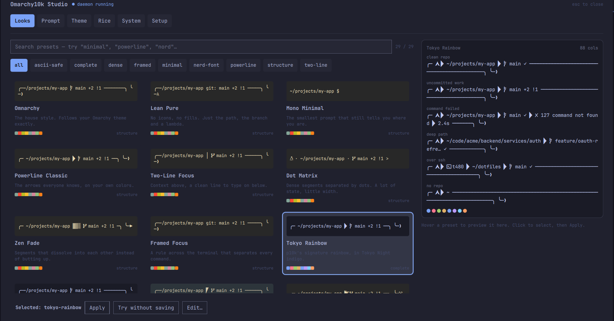
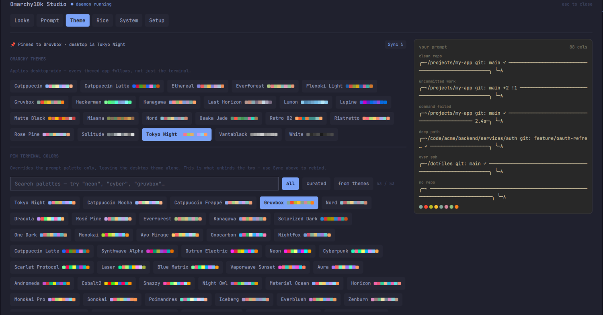
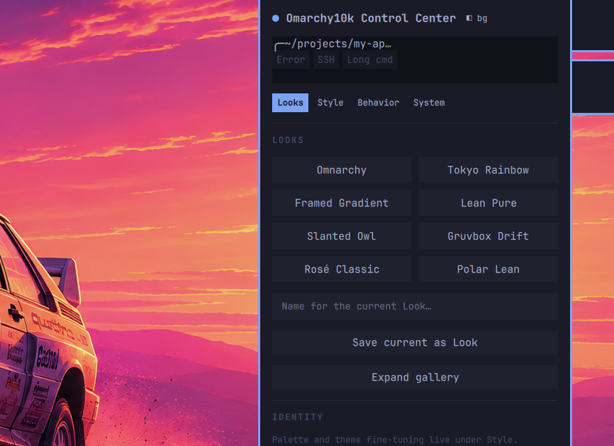

<div align="center">

# Omarchy10k

**A compiled daemon renders your prompt in under 5 ms. The desktop controls it.**

A reactive shell prompt and desktop-control layer for
[Omarchy](https://github.com/basecamp/omarchy) — Arch, Hyprland, Quickshell.
The visual language of Powerlevel10k, built the way Omarchy Quattro is built.

</div>



---

## Why a daemon

A prompt runs before every command you type, so its cost is a tax on the whole
session. Shelling out to `git` on the hot path is what makes a beautiful prompt
feel slow.

Omarchy10k separates the two. A per-shell Rust daemon holds the state; bash
sends it a context line and reads back a rendered prompt over a Unix socket.
Everything expensive happens off the hot path:

- **Git is asynchronous**, served from a stale-tolerant TTL cache. A prompt
  never waits on a subprocess.
- **The render is pure in-memory** — no forks, no file reads, no allocation
  storms.
- **The desktop is the UI.** The daemon already knows how to render any
  hypothetical config, so the Control Center asks it for real prompts instead
  of drawing an approximation.

That last point is the one that shapes everything: the preview you see in the
Studio is produced by the same code that draws your prompt.

## What's in the box

| | |
|---|---|
| **Prompt engine** | 25 segments · 11 style presets · 14 separator shapes · hue-anchored gradients · frames · transient prompts · right rail · vi-mode character · git and worktree awareness |
| **Presets** | 52 curated Looks and 53 palettes — 39 hand-tuned plus one derived from every Omarchy theme you have installed |
| **Control Center** | A summonable Studio and a bar popout, both driven by live daemon renders |
| **Bash layer** | Hook broker, per-shell daemon lifecycle, instant prompt, env channel — *coexisting* with Omarchy's own bash layer rather than replacing it |
| **Terminal integration** | OSC 7/8/52/133, XTVERSION probing, kitty graphics, DECSCUSR cursor shapes |

---

## Install

```bash
git clone https://github.com/DividedBeingCode/OmarchyMyBash.git && cd OmarchyMyBash
./install.sh
```

Then one line in `~/.bashrc`:

```bash
eval "$(omarchy10k init bash)"
```

`install.sh` builds the binaries into `~/.local/bin`, installs the Quattro
plugin, rice templates and desktop hooks. Nothing outside
`~/.config/omarchy10k`, `~/.local/bin` and the plugin directory is touched, and
`--uninstall` reverses all of it.

### The Control Center on its own

The repo is a valid Omarchy plugin, so the QML half can be added directly:

```bash
omarchy plugin add https://github.com/DividedBeingCode/OmarchyMyBash.git --enable --yes
```

**This installs the plugin only.** `omarchy plugin add` never builds anything —
deliberately, since plugins run unsandboxed inside a long-lived shell process.
Omarchy10k is a control surface for a prompt daemon, so without the `omarchy10k`
binary on `PATH` there is nothing to preview and nothing to apply. The Studio
says so plainly and names the script to run; `plugin add` clones the whole repo,
so the installer lands right beside the QML:

```bash
~/.config/omarchy/plugins/community.omarchy10k/install.sh
```

Omit `--enable` and the plugin lands disabled, so you can read the code before
it runs inside your shell.

---

## The Studio

Summon it from anywhere:

```bash
omarchy-shell shell summon community.omarchy10k
```

Six tabs, and on four of them a **pinned live preview** that never scrolls away
from the control you are turning.

| Tab | What it does |
|---|---|
| **Looks** | Browse 52 presets. Every card is a real prompt rendered in that preset's own colors. Hover previews, click selects, Apply commits |
| **Prompt** | Presets, separators, prompt characters, a searchable browser of 78 glyphs, per-segment toggles |
| **Theme** | Apply an Omarchy theme desktop-wide, or pin terminal colors independently. Every chip carries its actual palette |
| **Rice** | Terminal, git, and system-tool theming through the `o10k` templates |
| **System** | Doctor, benchmark, sessions, segment plugins, and the shell-layer claim map |
| **Setup** | The first-run wizard, driven by the CLI's own step definitions |



### A Look is a complete definition

Applying a Look sets **everything**: colors, style preset, separators, frame,
glyphs, prompt characters, line count. It is a whole design, not a patch over
whatever you were already on — so what you get is the Look, never a blend with
the last one you tried.

Colors, framing and glyphs are then separate controls for deviating from it.
Applying another Look replaces those deviations with that Look's own answer.

A Look does **not** touch which segments are enabled. Turning the battery
segment off is a standing decision, not part of a look.

If you would rather keep your colors, **Lock to desktop** on the Theme tab
binds them to the Omarchy theme; applying a Look then changes its shape and
leaves your palette alone. No Look can clear the lock.

### Gradients that stay in the family

A palette owns one gradient ramp, and everything that draws a gradient reads
it: the `gradient` preset's segment fills and the frame rule alike.

Its far end used to be an ANSI slot picked by comparing two channel bytes —
the `magenta` role for cool accents, `cyan` for warm ones. Synthwave's accent
is `#d53bce`, which is 213 red against 206 blue, so seven bytes decided the
answer and chose cyan. A preset whose own description reads *purple all the
way down* rendered a purple → `#00b0b1` teal rule.

The far end is now the accent rotated in [OKLCH](https://bottosson.github.io/posts/oklab/)
at constant lightness and chroma. Blue goes to purple, purple to hot pink,
green to cyan; a greyscale accent has no chroma to rotate, so a monochrome
theme stays monochrome, and holding lightness keeps the contrast work below
intact. A palette may override the derivation with an explicit two-color ramp
where the scheme is known for a particular pair — Gruvbox sweeps aqua to
mustard through its own green.

`[theme] gradient` is `auto`, `full`, or `off`, and the Studio's Theme tab
draws the ramp under every palette chip.

### Colors that are actually readable

Omarchy ships 22 themes; only some have a hand-tuned prompt palette. The rest
are **derived** — each theme's `colors.toml` roles are mapped across, then
repaired where they are unreadable as prompt text.

Contrast is measured in [APCA](https://git.apcacontrast.com/documentation/APCA_in_a_Nutshell.html)
rather than WCAG 2.x, because these palettes are dark and WCAG 2.x overstates
contrast for dark colors badly enough that its own analysis says it cannot
guide dark-mode design. Repairs walk lightness in
[OKLCH](https://bottosson.github.io/posts/oklab/), so hue and chroma hold
still — a monochrome theme stays monochrome.

The thresholds are calibrated against the curated palettes themselves, not
against APCA's prose tiers: gating at those tiers flagged Solarized Dark as
broken on nine of eleven roles, which is the instrument being wrong about the
goal. In practice the deriver repairs **8% of roles** and leaves 8 of the 22
themes untouched.

---

## The bar popout



Click the prompt glyph in the bar for quick changes without leaving what you
are doing: a compact two-scene preview, Looks, palettes, per-row
modified-vs-default ink with one-tap reset, and an undo timeline.
**Open Studio** at the top escalates to the full surface.

---

## Command line

```bash
omarchy10k configure      # p10k-style wizard, with live preview
omarchy10k look list      # browse the curated Looks
omarchy10k look apply tokyo-rainbow --transient    # try it; a reload reverts
omarchy10k layer          # who owns ls, cd, cat — o10k, Omarchy, or you
omarchy10k doctor         # diagnose the whole stack
omarchy10k benchmark      # measure the render budget
```

`doctor` is the one to run when something looks wrong. It reports your
terminal, how it was identified, its capability profile, and whether the
themed include is still wired into the terminal's own config:

```
  Terminal          ghostty 1.3.1-arch2 ✓ via O10K_TERM (probe or override)
      caps          OSC7 ✓  OSC8 ✓  OSC52 ✓  sixel ✘  kitty-gfx ✓  sync ✓
      theme include ghostty/config → o10k-ghostty.conf ✓
```

### Per-project prompts

Drop a `.o10k.toml` in a repo root. Display keys only — it is untrusted input
by design, so nothing there can execute anything:

```toml
[segments]
git = { enabled = false }
```

---

## Terminals

Ghostty and foot are both first-class, and both are tested end to end by
launching the real terminal and asserting what reaches the wire.

Terminals are identified by an **XTVERSION probe**, not by environment
variables, because environment variables do not work: foot deliberately unsets
`TERM_PROGRAM`, and Omarchy configures it to report `TERM=xterm-256color`. A
real foot session carries no identifying signal at all. The probe runs once per
shell and only when the environment is inconclusive — Ghostty is identified for
free — and never through tmux, where the answer would describe the wrong
terminal.

| | Ghostty | foot |
|---|---|---|
| OSC 8 hyperlinks, OSC 52 clipboard | ✓ | ✓ |
| OSC 133 semantic prompts | ✓ | ✓ |
| Graphics | kitty protocol | sixel |
| Mascot rendering | real image | half-blocks |

---

## Documentation

The [wiki](docs/wiki/INDEX.md) is the source of truth:
[architecture](docs/wiki/architecture.md) ·
[daemon](docs/wiki/daemon.md) ·
[protocol](docs/wiki/protocol.md) ·
[bash adapter](docs/wiki/bash-adapter.md) ·
[Quattro plugin](docs/wiki/quattro.md) ·
[configuration](docs/wiki/config.md) ·
[theme bridge](docs/wiki/theme.md) ·
[glossary](docs/wiki/glossary.md)

Every config key is documented in [config.md](docs/wiki/config.md), and the
NDJSON socket protocol in [protocol.md](docs/wiki/protocol.md).

## Status

- **396 unit tests** (293 daemon, 103 CLI), 77 QML component tests, 7 JS
  suites, plus integration and real-terminal end-to-end suites
- A `qmllint` gate that fails on parse errors and unqualified access
- Protocol 0.5 · crate 0.4.0
- Developed on Omarchy Quattro; tested on Ghostty 1.3 and foot 1.27

## License

MIT — see [LICENSE](LICENSE).
