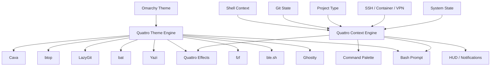
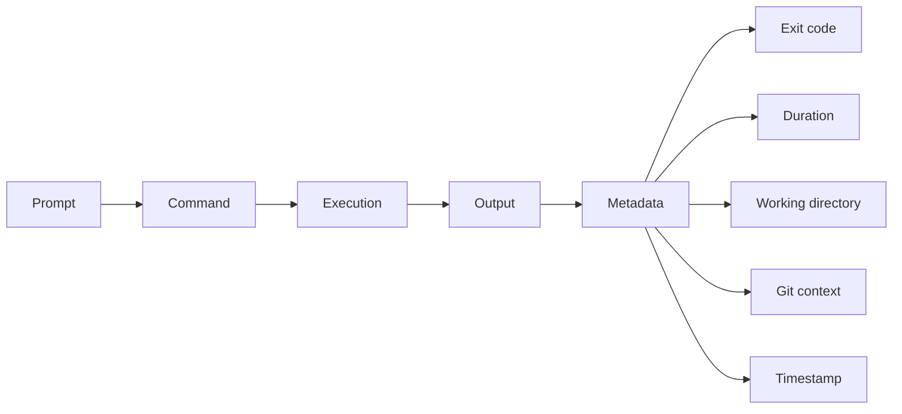
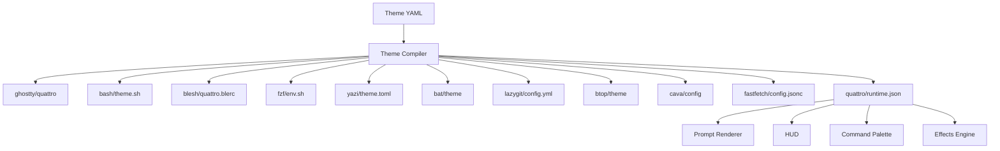
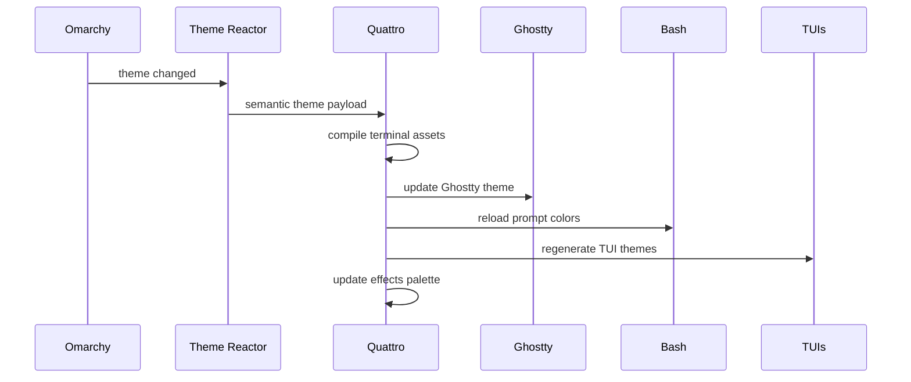

# Quattro Terminal Experience
## Terminal ricing, modern Unix replacements, Bash UX, Ghostty theming, and a unified theme architecture

> Goal: make the terminal feel like a polished, reactive environment rather than a decorated text box.

This document collects the terminal ideas discussed so far and turns them into a build-oriented direction for Quattro.

The central idea is simple:

**Do not treat the prompt, terminal emulator, shell, TUIs, and command output as separate products. Treat them as one interface.**

Quattro already has a theme engine. That gives it the foundation to synchronize the entire terminal experience around one active theme, one semantic color system, and one set of UX conventions.

---

# 1. Product vision

A normal riced terminal often looks like this:

- fancy prompt
- Nerd Font icons
- custom terminal palette
- Fastfetch on startup
- maybe a translucent background
- a few modern CLI replacements

That looks good, but it is still fundamentally a text box.

Quattro can go further.

The terminal should become:

- context aware
- theme aware
- project aware
- animated when appropriate
- spatial
- discoverable
- fast
- useful without becoming noisy
- consistent with the rest of Omarchy

Think of it as a lightweight terminal shell environment layered on top of Bash and Ghostty.



---

# 2. The design principles

## 2.1 Theme everything

A theme should not mean only "change the terminal background."

Changing the active Omarchy theme should propagate into:

- Ghostty
- Bash prompt
- ble.sh syntax highlighting
- command completion menus
- fzf
- Yazi
- bat
- LazyGit
- LazyDocker
- btop
- Cava
- Fastfetch
- Quattro overlays
- Quattro notifications
- terminal text effects
- command palette
- project indicators
- SSH state
- error and success states

The result should feel like one application.

---

## 2.2 Use semantic colors

Do not let each component independently decide what purple, green, or red means.

The theme engine should expose semantic tokens.

Example:

```yaml
name: violet-night

colors:
  background: "#11111b"
  surface: "#181825"
  surface_alt: "#1e1e2e"

  foreground: "#cdd6f4"
  muted: "#7f849c"
  subtle: "#585b70"

  accent: "#cba6f7"
  accent_alt: "#89b4fa"

  success: "#a6e3a1"
  warning: "#f9e2af"
  danger: "#f38ba8"
  info: "#89dceb"

  git_added: "#a6e3a1"
  git_modified: "#f9e2af"
  git_deleted: "#f38ba8"
  git_branch: "#cba6f7"

  ssh: "#89dceb"
  root: "#f38ba8"
  container: "#fab387"
```

Every generated config references these meanings.

This makes the visual language predictable.

Green means success everywhere.

Red means danger everywhere.

Purple can remain the main identity accent without forcing every element to be purple.

---

# 3. Replace the boring Unix defaults

Modern CLI tools are one of the easiest ways to make a Linux terminal feel dramatically more polished.

## Recommended baseline

| Traditional command | Replacement | Why |
|---|---|---|
| `ls` | `eza` | icons, colors, Git state, tree mode |
| `cat` | `bat` | syntax highlighting, line numbers, paging |
| `cd` | `zoxide` | directory jumping based on usage |
| `find` | `fd` | cleaner syntax and fast search |
| `grep` | `ripgrep` | extremely fast recursive search |
| shell history | `atuin` | searchable and context-aware history |
| `top` | `btop` | polished interactive system monitor |
| `du` | `dust` | visual disk usage |
| `df` | `duf` | readable filesystem overview |
| `ps` | `procs` | modern process listing |
| `man` discovery | `tldr` | concise examples |
| file browsing | `yazi` | fast terminal file manager with previews |
| Git CLI browsing | `lazygit` | interactive Git interface |
| Docker CLI browsing | `lazydocker` | interactive Docker interface |
| `curl` for humans | `xh` or `httpie` | cleaner HTTP interaction |
| JSON inspection | `jq` | structured JSON querying |
| directory tree | `eza --tree` or `erdtree` | visual tree output |

These should not necessarily replace the original binaries.

Prefer friendly aliases or wrapper commands.

Example:

```bash
alias ls='eza --icons=auto --group-directories-first'
alias ll='eza -lah --icons=auto --group-directories-first --git'
alias tree='eza --tree --icons=auto'

alias cat='bat --paging=never'
alias grep='rg'
alias top='btop'
alias du='dust'
alias df='duf'
alias ps='procs'
```

For compatibility-sensitive scripts, the real Unix commands should remain available.

---

# 4. The modern Bash stack

Bash is attractive for Quattro because it is universal, predictable, and deeply compatible.

The goal should not be to turn Bash into Zsh.

The goal should be to make Bash feel intentional and modern.

## Recommended components

### ble.sh

ble.sh is one of the most important pieces.

It can add:

- syntax-aware highlighting
- autosuggestions
- improved completion
- completion menus
- history-based completion
- Vim editing
- right prompts
- transient prompts
- status lines
- richer line editing

This gives Bash much of the interactive polish people associate with Fish or modern Zsh setups.

### Atuin

Use Atuin for intelligent shell history.

Potential Quattro integration:

- theme-aware Atuin UI
- project-aware history search
- shortcut from command palette
- current directory filtering
- current repo filtering
- host filtering for SSH sessions

### zoxide

Directory navigation should feel predictive.

Examples:

```bash
z omarchy
z quattro
z docs
```

Potential Quattro feature:

Show the top zoxide destinations in the command palette.

### fzf

fzf can become one of the core interaction primitives.

Use it for:

- history
- files
- processes
- branches
- workspaces
- SSH hosts
- commands
- themes
- projects
- environment variables

Quattro can wrap these as discoverable actions instead of expecting users to memorize fzf key combinations.

---

# 5. Bash prompt philosophy

Avoid building a giant permanent dashboard into PS1.

The prompt should expose only the information relevant at the current moment.

## Default state

```text
 ~/src/quattro  main
❯
```

## Dirty Git state

```text
 ~/src/quattro  main ✗3
❯
```

## Ahead of remote

```text
 ~/src/quattro  main ↑2
❯
```

## Rust project

```text
 ~/src/quattro  main ✗3  rust 1.90
❯
```

## Container

```text
 docker:quattro-dev  ~/src/quattro  main
❯
```

## SSH

```text
 ssh:t480-lab  ~/src/quattro
❯
```

## Root

Root should be visually unmistakable.

```text
 ROOT  /etc/systemd
#
```

Do not make root merely another icon buried in a 12-segment prompt.

---

# 6. Prompt tiers

Use progressive disclosure.

## Tier 1: always visible

- current directory
- Git branch when applicable
- prompt glyph

## Tier 2: visible only when relevant

- dirty Git state
- ahead or behind
- SSH host
- container
- root
- language runtime
- virtual environment

## Tier 3: temporary

- command duration
- exit status
- background jobs
- battery warning
- network state
- deployment environment

These can appear for one prompt cycle and then disappear.

Example:

```text
 ~/src/quattro  main
❯ cargo test

✗ failed  12.4s

 ~/src/quattro  main ✗1
❯
```

---

# 7. Transient prompts

Old prompts should collapse after commands execute.

Instead of this:

```text
 ~/src/quattro  main rust 1.90
❯ cargo check

 ~/src/quattro  main rust 1.90
❯ git status

 ~/src/quattro  main rust 1.90
❯ git diff
```

Quattro can render:

```text
❯ cargo check
❯ git status
❯ git diff

 ~/src/quattro  main rust 1.90
❯
```

This dramatically improves terminal readability.

ble.sh already provides useful infrastructure for implementing this style in Bash.

---

# 8. Ghostty theming

Ghostty should be treated as Quattro's rendering layer.

The Quattro theme engine should generate a Ghostty theme file whenever the active Omarchy theme changes.

Ghostty supports theme-controlled settings including:

- background
- foreground
- cursor color
- cursor text color
- selection colors
- ANSI palette
- extended palette entries
- fonts
- other config values when loaded as a theme

A generated theme could live at:

```text
~/.config/ghostty/themes/quattro
```

Then Ghostty config uses:

```text
theme = quattro
```

## Generated Ghostty theme

```ini
background = #11111b
foreground = #cdd6f4

cursor-color = #cba6f7
cursor-text = #11111b

selection-background = #45475a
selection-foreground = #cdd6f4

palette = 0=#45475a
palette = 1=#f38ba8
palette = 2=#a6e3a1
palette = 3=#f9e2af
palette = 4=#89b4fa
palette = 5=#cba6f7
palette = 6=#89dceb
palette = 7=#bac2de

palette = 8=#585b70
palette = 9=#f38ba8
palette = 10=#a6e3a1
palette = 11=#f9e2af
palette = 12=#89b4fa
palette = 13=#cba6f7
palette = 14=#94e2d5
palette = 15=#cdd6f4
```

---

# 9. Ghostty theme dimensions beyond color

The theme engine can support visual personality, not only palette swaps.

## Font

Theme profiles could optionally suggest:

- font family
- font size
- font thickness
- font features

Examples:

### Minimal

```text
JetBrains Mono
```

### Retro

```text
Iosevka
```

### Hacker

```text
Commit Mono
```

### Rounded

```text
Maple Mono
```

The user's explicit font override should always win.

---

## Cursor personality

Theme variants can define:

- block cursor
- bar cursor
- underline cursor
- blink behavior
- cursor accent

Potential concept:

```yaml
cursor:
  shape: block
  blink: false
  color: accent
```

---

## Background treatment

Theme profiles can define:

- background color
- opacity
- blur preference
- inactive pane contrast
- selection contrast

Quattro should avoid making transparency mandatory.

A theme can suggest transparency while user preference remains authoritative.

---

## Window identity

Ghostty can visually reinforce Quattro modes.

Examples:

- normal mode uses standard background
- SSH session adds a subtle SSH indicator
- root session adds a danger accent
- production environment adds a warning treatment
- focused terminal gets stronger border or surface contrast
- scratch terminal uses a slightly different surface

Do this subtly.

A production shell should not turn the entire terminal bright red.

---

# 10. Ghostty shell integration

Ghostty has Bash shell integration that enables terminal-aware shell behavior.

Quattro should preserve and build on it.

Useful integration features include:

- prompt boundaries
- jumping between prompts
- command-output selection
- prompt-aware cursor behavior
- working directory propagation
- better prompt redraw behavior

Quattro can use prompt boundaries as an architectural primitive.

That creates possibilities like:

```text
command block
├── prompt
├── command
├── output
├── duration
├── exit state
└── metadata
```

This is much more powerful than treating the scrollback buffer as an undifferentiated stream of characters.

---

# 11. Quattro Bash theme generation

The Quattro theme engine should generate a Bash-specific theme artifact.

Example:

```bash
export QUATTRO_BG="#11111b"
export QUATTRO_FG="#cdd6f4"
export QUATTRO_MUTED="#7f849c"
export QUATTRO_ACCENT="#cba6f7"
export QUATTRO_SUCCESS="#a6e3a1"
export QUATTRO_WARNING="#f9e2af"
export QUATTRO_DANGER="#f38ba8"
export QUATTRO_INFO="#89dceb"
```

The prompt renderer then converts semantic colors into ANSI sequences.

This separation matters.

The prompt logic should say:

```text
branch = accent
dirty = warning
success = success
error = danger
ssh = info
root = danger
```

It should not say:

```text
branch = purple
dirty = yellow
```

---

# 12. ble.sh theming

ble.sh can become the syntax layer of the Quattro theme.

Map syntax categories to semantic colors.

Example concept:

| Syntax category | Theme token |
|---|---|
| executable command | `accent` |
| valid path | `info` |
| string | `success` |
| number | `warning` |
| variable | `accent_alt` |
| option | `foreground` |
| comment | `muted` |
| invalid syntax | `danger` |
| autosuggestion | `subtle` |

This means command input itself belongs to the active theme.

---

# 13. fzf theming

fzf appears everywhere, so it should feel native.

Map:

- background → `background`
- panel → `surface`
- selected row → `surface_alt`
- normal text → `foreground`
- muted metadata → `muted`
- pointer → `accent`
- selected match → `accent`
- border → `subtle`

Quattro can generate:

```bash
export FZF_DEFAULT_OPTS="
  --border
  --info=inline
  --pointer='❯'
  --marker='✓'
"
```

Color arguments should be generated from the active theme rather than hard coded.

---

# 14. Yazi theming

Yazi can be one of the most visually impressive pieces of the stack.

Use it for:

- image previews
- directory navigation
- archive previews
- Git-aware browsing
- file metadata
- quick open actions

Quattro theme integration should style:

- selected file
- directory
- executable
- image
- archive
- symlink
- Git states
- border
- preview pane
- status bar

A user should be able to change Omarchy themes and immediately see Yazi follow.

---

# 15. bat theming

bat should use a syntax theme derived from or selected to match the active Quattro palette.

At minimum synchronize:

- background
- foreground
- line number color
- Git modification markers
- highlighted line
- syntax theme family

Long term, Quattro could generate a custom syntax theme bundle.

---

# 16. LazyGit and LazyDocker

These TUIs are often open for long periods.

If they remain visually disconnected from the system theme, the unified illusion breaks.

Quattro should generate colors for:

- active panel
- inactive panel
- selected line
- status
- warning
- error
- branch
- commit
- changed file
- staged file

---

# 17. btop

btop can inherit:

- background
- graph text
- CPU gradient
- memory gradient
- disk accents
- process highlight
- temperature warning colors

Quattro can also choose whether graphs are vivid or restrained based on theme personality.

Example theme metadata:

```yaml
personality:
  saturation: medium
  animation: subtle
  graph_style: restrained
```

---

# 18. Cava

Cava is ideal for expressive themes.

Theme engine can generate:

- gradient start
- gradient end
- bar count
- bar width
- sensitivity presets
- visual mode

Possible theme personalities:

- neon
- monochrome
- vaporwave
- amber terminal
- Matrix
- Tokyo Night
- Nord
- monochrome purple

Cava can also become part of Quattro's ambient mode.

---

# 19. Fastfetch

Fastfetch should be a theme-aware identity screen rather than a permanent startup tax.

Possible triggers:

- first terminal of the session
- explicit `quattro info`
- new SSH session
- screensaver wake
- command palette action

Use:

- Omarchy logo
- Quattro logo
- theme name
- host
- uptime
- kernel
- shell
- package count
- battery
- desktop
- terminal

Theme all logo and label colors semantically.

---

# 20. Terminal toys and visual effects

These are not core productivity features, but they make the environment fun.

Useful inspirations:

- `pipes.sh`
- `cmatrix`
- `cbonsai`
- `asciiquarium`
- `tty-clock`
- Cava
- ASCII fire
- procedural particles
- snow
- rain
- matrix effects
- terminal text animations
- terminal screensavers

Quattro should treat these as an effects library.

---

# 21. Contextual command effects

The most interesting direction is making effects respond to events.

## Successful Git push

```text
❯ git push

        local ───────●──────────► origin

                 ✓ pushed
```

Possible visual effect:

- short green sweep
- small particle burst
- branch icon pulse

Keep it under roughly a fraction of a second unless the user explicitly enables theatrical mode.

---

## Failed build

```text
❯ cargo build

         BUILD FAILED
             ✕
```

Possible effect:

- brief red glitch
- small shake
- red edge flash

Avoid making errors annoying.

---

## SSH connection

```text
             local
               │
               │ encrypted
               ▼
        ┌───────────────┐
        │   T480-LAB    │
        │  192.168.1.42 │
        └───────────────┘

        Connected in 84 ms
```

The animation could appear only for interactive SSH sessions.

---

## sudo authentication

Possible treatment:

```text
        ┌────────────┐
        │     🔒     │
        │   sudo     │
        └────────────┘

              ↓

        ┌────────────┐
        │     🔓     │
        │ authorized │
        └────────────┘
```

This should be subtle and optional.

---

# 22. Terminal HUD

Create a temporary system HUD.

Possible shortcut:

```text
Super + Shift + I
```

or a shell command:

```bash
quattro hud
```

Example:

```text
╭─ SYSTEM ────────────────────╮
│ CPU      ███░░░░░    34%    │
│ RAM      █████░░░    51%    │
│ BAT      ████████    82%    │
│ TEMP                  57°C   │
│ VPN      PIA             ✓   │
│ NET      ↓42M  ↑8M           │
╰─────────────────────────────╯
```

The HUD should disappear automatically.

Potential modules:

- CPU
- RAM
- disk
- battery
- dual battery
- temperature
- Wi-Fi
- VPN
- public IP
- network throughput
- active container count
- current Git project
- current audio device

---

# 23. Command palette

This may be one of the highest-value Quattro features.

Example shortcut:

```text
Ctrl + Space
```

UI:

```text
╭─ Quattro ─────────────────────────╮
│ > git                             │
│                                   │
│   Git status                      │
│   Git branches                    │
│   Git log                         │
│   GitHub pull requests            │
│   Open LazyGit                    │
╰───────────────────────────────────╯
```

Potential sources:

- static commands
- shell functions
- aliases
- project actions
- package scripts
- Make targets
- justfile targets
- Git branches
- SSH hosts
- zoxide directories
- recent Atuin commands
- Omarchy actions
- theme actions

This becomes a terminal equivalent of Spotlight, Raycast, or a modern IDE command palette.

---

# 24. Project awareness

Entering a project should change what the terminal knows how to do.

## Rust repo

Detect:

```text
Cargo.toml
```

Expose:

- cargo check
- cargo test
- cargo run
- cargo build
- cargo clippy
- cargo fmt
- dependency tree

Prompt:

```text
 ~/src/quattro  main  rust
❯
```

---

## Node project

Detect:

```text
package.json
```

Expose package scripts directly.

Example palette:

```text
npm
├── dev
├── build
├── test
├── lint
└── deploy
```

---

## Rails app

Detect:

```text
Gemfile
config/application.rb
```

Expose:

- Rails server
- console
- migrations
- routes
- tests
- jobs
- database actions

---

## Python project

Detect:

- `pyproject.toml`
- `requirements.txt`
- `.venv`

Expose:

- active environment
- test runner
- formatter
- linter
- package commands

---

# 25. Project profile system

Projects can optionally define Quattro metadata.

Example:

```yaml
# .quattro.yml

name: quattro

accent: inherit

actions:
  test:
    command: cargo test

  lint:
    command: cargo clippy

  run:
    command: cargo run

environment:
  show:
    - RUST_LOG
```

This gives developers a lightweight way to teach Quattro about a repo.

---

# 26. Smart command output

A major opportunity is replacing walls of output with structured presentation.

Do not globally intercept every Unix command.

Start with opt-in wrappers for common commands.

Examples:

```bash
q git status
q systemctl status bluetooth
q docker ps
q ip addr
```

Later, selected commands can get transparent enhancements.

---

## systemctl

Instead of:

```text
40 lines of service metadata
```

Render:

```text
╭─ bluetooth.service ─────────────╮
│ Status       ● active           │
│ Uptime       2h 14m             │
│ Memory       8.3 MB             │
│ PID          842                │
│ Restart      no                 │
╰─────────────────────────────────╯

Recent logs
  03:14 Connected MX Master 3S
  03:18 Device disconnected
```

Always provide a way to show raw output.

---

## Git push

```text
╭─ Push ──────────────────────────╮
│ Repo       quattro              │
│ Branch     main                 │
│ Remote     origin               │
│ Commits    3                    │
│ Objects    42                   │
╰─────────────────────────────────╯

████████████████████████ 100%

✓ pushed in 1.2s
```

---

# 27. Command blocks

A future Quattro terminal abstraction could treat each command as an object.



This enables:

- collapse command output
- copy full command block
- rerun command
- explain command
- send command to AI
- bookmark command
- search previous command blocks
- jump between prompts
- save command output
- share a sanitized command block

Ghostty shell integration already provides useful prompt-boundary awareness that can help support this direction.

---

# 28. Notifications

Long-running commands should not require staring at the terminal.

Example:

```text
╭─ Build finished ─────────────╮
│ ✓ quattro                    │
│ 1m 42s                       │
╰──────────────────────────────╯
```

Rules:

- notify only after configurable duration
- suppress while terminal is focused if desired
- show failure more prominently than success
- allow per-command patterns
- integrate with desktop notifications

Example config:

```yaml
notifications:
  long_command_seconds: 15
  notify_success: true
  notify_failure: true
  suppress_when_focused: true
```

---

# 29. Ambient terminal mode

The terminal can become part of Omarchy's ambient experience.

When idle:

- Cava visualization
- clock
- system status
- weather if explicitly enabled
- Git activity
- procedural particles
- digital rain
- theme animation
- screensaver
- ASCII art
- rotating system information

The active Omarchy theme controls the presentation.

Example:

```text
Tokyo Night
    ↓
Ghostty
    ↓
Bash
    ↓
fzf
    ↓
Yazi
    ↓
Cava
    ↓
screensaver
```

---

# 30. Theme personalities

Color is only one dimension.

A Quattro theme can contain behavioral metadata.

Example:

```yaml
personality:
  motion: subtle
  density: compact
  borders: rounded
  glow: low
  contrast: medium
  prompt_style: minimal
  effects: restrained
```

Possible personalities:

## Minimal

- little animation
- compact prompt
- subtle borders
- muted metadata

## Neon

- stronger accent
- brighter Cava
- more energetic success animations
- vivid selected states

## Retro

- block cursor
- amber or green palette
- CRT-like effects
- scanline-inspired screensaver

## Hacker

- dense information
- Matrix-inspired ambient mode
- strong Git and system context
- monochrome accents

## Calm

- low saturation
- slow ambient animation
- little visual noise

---

# 31. Theme engine output architecture

Treat the Quattro theme as the source of truth.



Suggested generated directory:

```text
~/.config/quattro/generated/
├── ghostty/
│   └── theme
├── bash/
│   └── theme.sh
├── blesh/
│   └── theme.blerc
├── fzf/
│   └── env.sh
├── yazi/
│   └── theme.toml
├── bat/
│   └── theme
├── lazygit/
│   └── theme.yml
├── btop/
│   └── theme.theme
├── cava/
│   └── config
├── fastfetch/
│   └── config.jsonc
└── runtime.json
```

Generated files should never be hand edited.

User overrides belong elsewhere.

---

# 32. Override hierarchy

A robust precedence model:

```text
Quattro defaults
    ↓
Omarchy theme
    ↓
Quattro theme profile
    ↓
User global overrides
    ↓
Project overrides
    ↓
Runtime context
```

Example:

The active theme defines purple as `accent`.

The user overrides terminal opacity.

A project adds an environment label.

SSH runtime adds an SSH indicator.

None of those layers need to rewrite the base theme.

---

# 33. Runtime context engine

Potential context inputs:

```text
Shell
├── cwd
├── last exit code
├── command duration
├── jobs
└── root state

Git
├── repo
├── branch
├── dirty state
├── ahead
└── behind

Project
├── language
├── package manager
├── scripts
└── environment

System
├── battery
├── temperature
├── network
├── VPN
└── load

Session
├── local
├── SSH
├── container
├── tmux
└── terminal
```

Quattro should cache expensive state.

Do not execute ten subprocesses before every prompt.

---

# 34. Performance budget

Terminal polish dies immediately if the prompt feels slow.

Suggested goals:

| Operation | Target |
|---|---|
| basic prompt render | effectively instant |
| Git state | under tens of milliseconds in normal repos |
| project detection | cached |
| theme switch | visually immediate |
| command palette open | immediate |
| HUD open | under perceptual delay |
| effects | never block command execution |

Heavy work should be:

- cached
- asynchronous where architecture permits
- refreshed on relevant events
- avoided on every prompt

The shell must always remain usable if Quattro components fail.

---

# 35. Failure philosophy

Quattro should degrade gracefully.

If:

- theme compiler fails
- Git detection fails
- Atuin is unavailable
- Yazi is missing
- ble.sh fails to load
- Quattro daemon is not running

the user should still get a functioning Bash shell.

Never make visual polish a dependency for basic terminal access.

---

# 36. Suggested Quattro commands

```text
quattro theme
quattro theme list
quattro theme reload

quattro hud

quattro palette

quattro project
quattro project actions

quattro history

quattro files

quattro git

quattro ssh

quattro effects
quattro effects test

quattro doctor
```

Potential shorthand:

```text
q theme
q hud
q project
q git
```

---

# 37. Command palette action model

Internally, actions could use a generic schema.

```yaml
id: git.lazygit
label: Open LazyGit
icon: git
category: Git

when:
  git_repo: true

run:
  command: lazygit
```

Rust action:

```yaml
id: rust.test
label: Run tests
icon: test
category: Rust

when:
  file_exists: Cargo.toml

run:
  command: cargo test
```

This makes the palette extensible without hard coding every integration.

---

# 38. Quattro plugin opportunities

Potential plugin categories:

## Languages

- Rust
- Python
- Node
- Ruby
- Go
- Java

## Tools

- Docker
- Podman
- Kubernetes
- Terraform
- Git
- GitHub
- SSH

## System

- battery
- VPN
- network
- audio
- Bluetooth
- mounts
- services

## Fun

- Cava
- Matrix
- weather
- ASCII art
- timers
- focus mode
- screensavers

---

# 39. Terminal modes

Quattro could offer temporary modes.

## Focus mode

- minimal prompt
- no effects
- muted palette
- notifications suppressed

## Presentation mode

- larger font
- higher contrast
- larger prompt
- command output spacing
- animations enabled

## Battery mode

- disable expensive ambient features
- no blur suggestions
- reduce polling
- simplify system modules

## SSH mode

- host emphasized
- remote context visible
- local-only actions hidden

## Production mode

- production badge
- dangerous commands highlighted
- stronger confirmation UX for selected operations

---

# 40. Theme reactor integration

Since Quattro already has a theme engine, the terminal can be one consumer of a wider Omarchy theme event.



Best case behavior:

1. User changes Omarchy theme.
2. Quattro receives the theme event.
3. Generated files update.
4. Ghostty reloads configuration.
5. New prompts immediately use new colors.
6. New TUI launches use the same theme.
7. Existing Quattro overlays use the new palette.

No logout.

No shell restart.

No manual config edits.

---

# 41. What not to do

Avoid classic ricing mistakes.

## Do not turn the prompt into a cockpit

If the user needs CPU, RAM, temperature, battery, Docker containers, Kubernetes context, Node version, Rust version, Python version, time, hostname, username, Git status, VPN, and weather permanently visible, the prompt has failed.

Put occasional information in the HUD or command palette.

---

## Do not animate routine typing

Animations should mark events.

Good:

- successful deployment
- failed build
- SSH connection
- theme transition
- long command completion

Bad:

- animating every `ls`
- delaying prompt appearance
- typing effects on every command
- motion that blocks interaction

---

## Do not break Unix compatibility

Aliases and wrappers should improve interactive use.

Scripts should still be able to call standard tools.

---

## Do not hide raw output

Smart summaries must provide a path to original output.

Examples:

```text
r     raw output
l     logs
c     copy
q     close
```

---

# 42. Suggested implementation phases

## Phase 1: unified terminal theme

Build generators for:

- Ghostty
- Bash prompt
- ble.sh
- fzf
- Yazi
- bat
- LazyGit
- btop
- Cava

This creates immediate visual coherence.

---

## Phase 2: modern shell UX

Integrate:

- ble.sh
- Atuin
- zoxide
- fzf
- eza
- bat
- fd
- ripgrep
- btop
- dust
- duf
- procs
- tldr
- Yazi
- LazyGit

Ship sane defaults with easy opt-outs.

---

## Phase 3: context engine

Implement cached detection for:

- Git
- project type
- SSH
- container
- root
- command duration
- exit state

Connect it to the prompt.

---

## Phase 4: command palette

Start with:

- recent directories
- recent history
- themes
- Git actions
- project actions
- SSH hosts
- Omarchy actions

This may become Quattro's signature interaction.

---

## Phase 5: HUD

Add:

- CPU
- RAM
- battery
- temperature
- network
- VPN
- current project

Keep it transient.

---

## Phase 6: notifications

Long command completion.

Build completion.

Test completion.

Deployment completion.

---

## Phase 7: effects engine

Add event-driven effects.

Start with:

- success
- failure
- Git push
- SSH
- sudo
- theme switch

Keep effects short and configurable.

---

## Phase 8: command blocks

Use shell integration metadata to make terminal history more structured.

Possible actions:

- jump
- copy
- rerun
- collapse
- save
- explain

---

## Phase 9: smart command adapters

Start opt-in.

Good candidates:

- Git
- systemctl
- Docker
- package manager
- network tools

Do not attempt to replace arbitrary stdout.

---

# 43. Signature Quattro features

If Quattro needs a short list of features that make people immediately understand why it is different, these are the strongest candidates.

## 1. Full-stack terminal theming

One Omarchy theme automatically styles Ghostty, Bash, completion, fuzzy search, file manager, Git UI, system monitors, visualizers, and Quattro overlays.

## 2. Context-reactive Bash prompt

Minimal by default, rich only when context requires it.

## 3. Terminal command palette

Spotlight or Raycast for shell actions.

## 4. Project-aware actions

The terminal understands the repo the user is standing in.

## 5. Event-driven terminal effects

Tiny visual responses to meaningful events.

## 6. Temporary HUD

System information on demand instead of permanent prompt clutter.

## 7. Structured command blocks

Commands become navigable objects rather than raw scrollback.

## 8. Ambient terminal mode

Idle terminals become part of the desktop's visual experience.

---

# 44. Example final experience

The user changes Omarchy to a purple theme.

Immediately:

- Ghostty switches palette
- Bash prompt becomes purple-accented
- ble.sh syntax colors update
- fzf selection uses the same purple
- Yazi borders and selection update
- bat uses matching syntax colors
- LazyGit highlights update
- btop graphs shift
- Cava uses a purple gradient
- Fastfetch uses matching logo colors
- Quattro HUD uses the same surfaces
- command palette uses the same accent
- screensaver uses the same effect palette

The user enters:

```bash
cd ~/src/quattro
```

Quattro detects:

```text
Rust
Git
GitHub remote
Cargo project
```

Prompt becomes:

```text
 ~/src/quattro  main  rust
❯
```

The user presses:

```text
Ctrl + Space
```

They see:

```text
╭─ Quattro ───────────────────────╮
│ >                               │
│                                 │
│   Run project                   │
│   Run tests                     │
│   Cargo check                   │
│   Open LazyGit                  │
│   Git branches                  │
│   Project files                 │
│   Search history                │
╰─────────────────────────────────╯
```

They select tests.

Tests run.

If successful:

```text
✓ 128 tests passed  4.2s
```

with a tiny accent animation.

If the command takes more than the configured threshold and the terminal is no longer focused, Quattro sends a desktop notification.

The terminal feels alive, but it never gets in the way.

---

# 45. Recommended default stack

If Quattro shipped with an opinionated terminal experience, this would be a strong default:

```text
Terminal       Ghostty
Shell          Bash
Line editor    ble.sh
History        Atuin
Navigation     zoxide
Fuzzy finder   fzf
Prompt         Quattro native prompt
Listing        eza
File viewer    bat
Search         ripgrep + fd
File manager   Yazi
Git UI         LazyGit
Docker UI      LazyDocker
System         btop
Disk usage     dust + duf
Processes      procs
Help           tldr
Visualizer     Cava
System info    Fastfetch
```

Quattro then becomes the integration layer that makes all of these feel like one product.

---

# 46. The larger opportunity

Most terminal ricing projects optimize for screenshots.

Quattro can optimize for experience.

The differentiator is not:

> "Our prompt has prettier separators."

It is:

> **The terminal understands where you are, what you are doing, what the system is doing, and what the current Omarchy theme is, then adapts without becoming distracting.**

That is much closer to the polish people associate with macOS, modern IDEs, and premium desktop software.

The shell remains Bash.

The terminal remains Ghostty.

The underlying Unix tools remain available.

Quattro supplies the missing layer of cohesion.

---

# 47. Reference notes

Useful upstream documentation and projects:

- Ghostty configuration: https://ghostty.org/docs/config
- Ghostty themes: https://ghostty.org/docs/features/theme
- Ghostty shell integration: https://ghostty.org/docs/features/shell-integration
- ble.sh: https://github.com/akinomyoga/ble.sh
- Starship configuration reference: https://starship.rs/config/
- Atuin: https://atuin.sh/
- zoxide: https://github.com/ajeetdsouza/zoxide
- fzf: https://github.com/junegunn/fzf
- eza: https://eza.rocks/
- bat: https://github.com/sharkdp/bat
- fd: https://github.com/sharkdp/fd
- ripgrep: https://github.com/BurntSushi/ripgrep
- Yazi: https://yazi-rs.github.io/
- LazyGit: https://github.com/jesseduffield/lazygit
- LazyDocker: https://github.com/jesseduffield/lazydocker
- btop: https://github.com/aristocratos/btop
- dust: https://github.com/bootandy/dust
- duf: https://github.com/muesli/duf
- procs: https://github.com/dalance/procs
- Cava: https://github.com/karlstav/cava
- Fastfetch: https://github.com/fastfetch-cli/fastfetch
